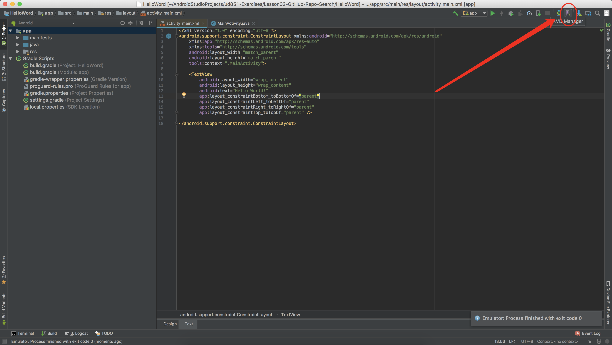
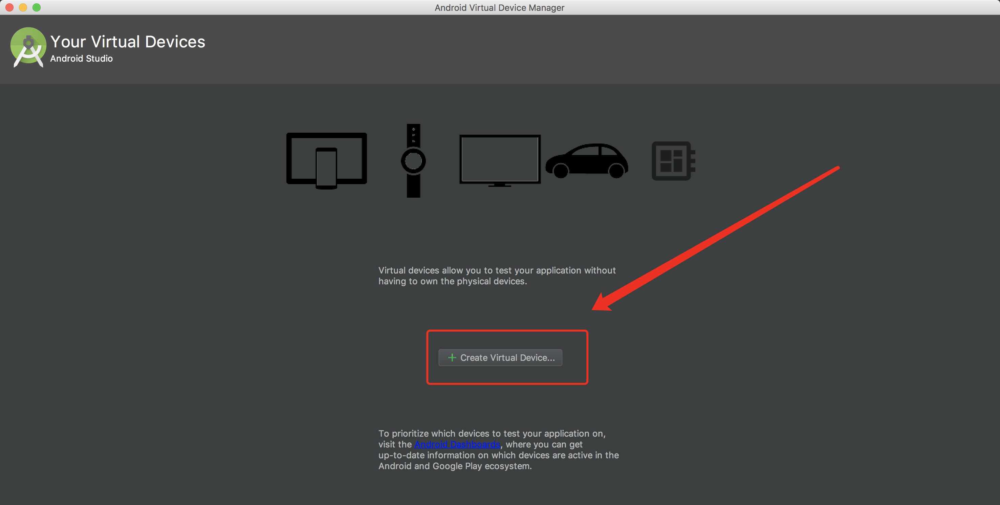
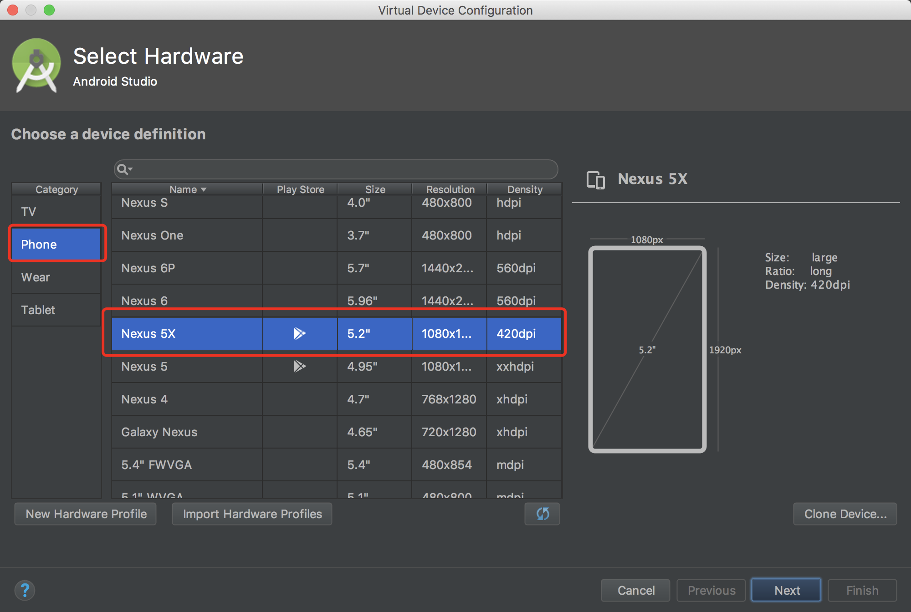
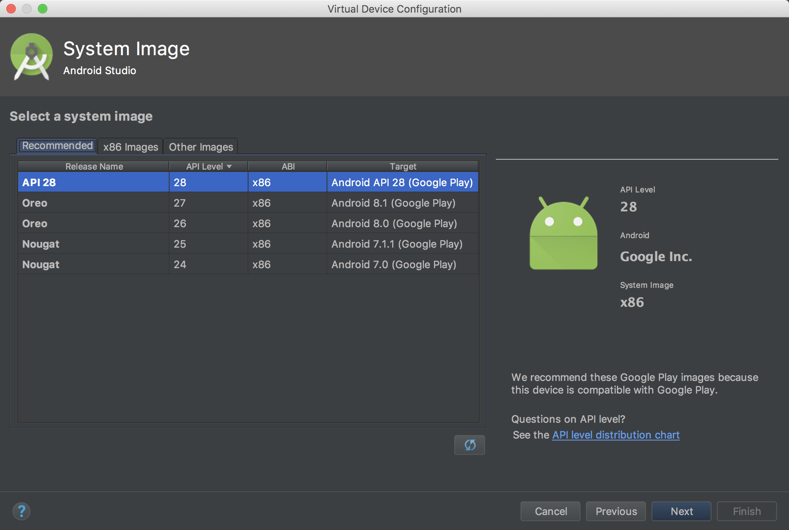
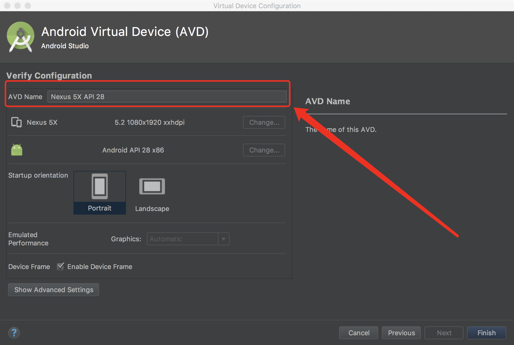
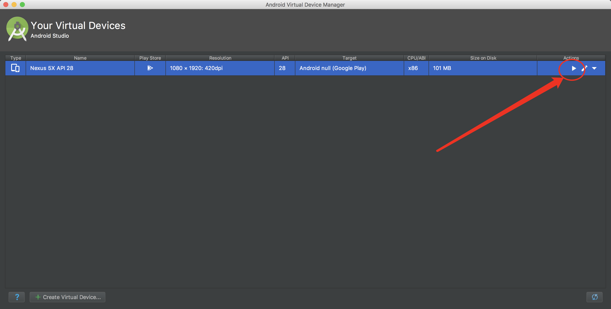
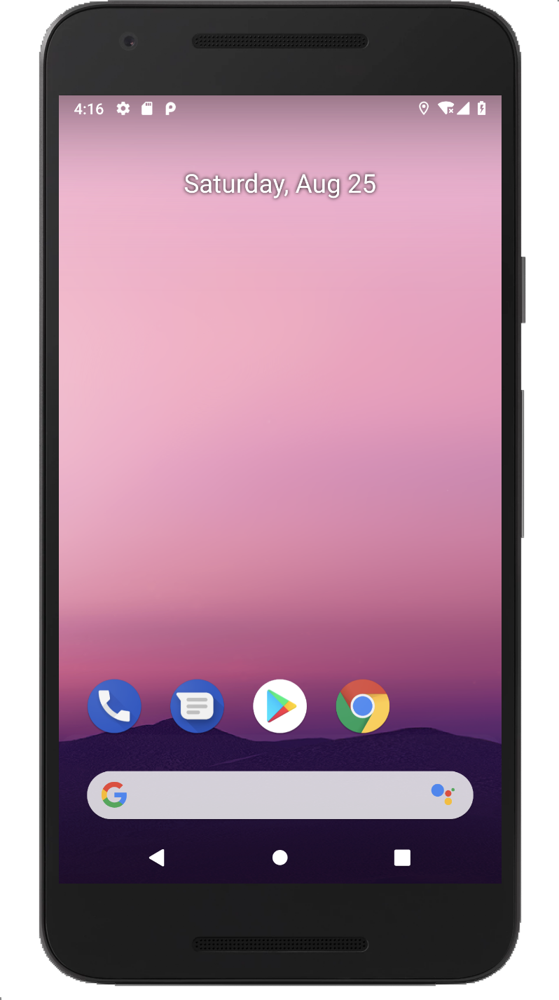

### android开发之创建虚拟机

> 上一章节创建了一个helloWord应用，要让应用运行起来虚拟机是少不了的，在进行安卓开发时可以使用虚拟机也可以使用真机调度，虚拟机方便快捷。本章节讲述如何创建安卓虚拟机(ADV)

#### 第一步：打开虚拟机管理器

#### 第二步：创建虚拟机

#### 第三步：选择虚拟支持的设备

#### 第四步：选择系统镜像

#### 第五步：设置虚拟机的名字

#### 第六步：启动虚拟机

#### 第七步：虚拟机启动后的样子
