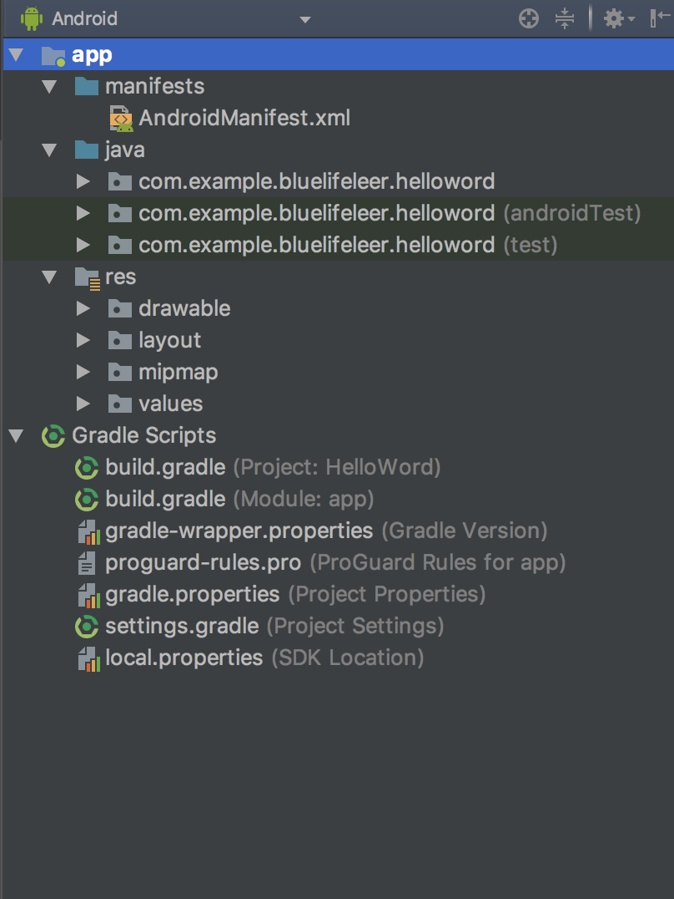

### 安卓开发目录结构介绍

> 前面讲了如何创建一个helloWord应用跟创建虚拟机，本章节介绍安卓开发目录结构

#### app > java > com.example.myfirstapp > MainActivity.java 

* 这是主 Activity（您的应用的入口点）。当您构建和运行应用时，系统会启动此 Activity 的实例并加载其布局。

#### app > res > layout > activity_main.xml 

* 此 XML 文件会定义 Activity 界面的布局。它包含一个带有文本“Hello world!”的 TextView 元素。

#### app > manifests > AndroidManifest.xml 

* manifest 文件描述应用的基本特性并定义其每个组件。

#### Gradle Scripts > build.gradle 

* 您会看到具有此名称的两个文件：一个用于项目，一个用于“应用”模块。每个模块均有自己的 build.gradle 文件，但此项目当前仅有一个模块。您将主要使用模块的 build.gradle 文件配置 Gradle 工具编译和构建您的应用的方式。如需了解有关此文件的更多信息，请参阅配置构建。