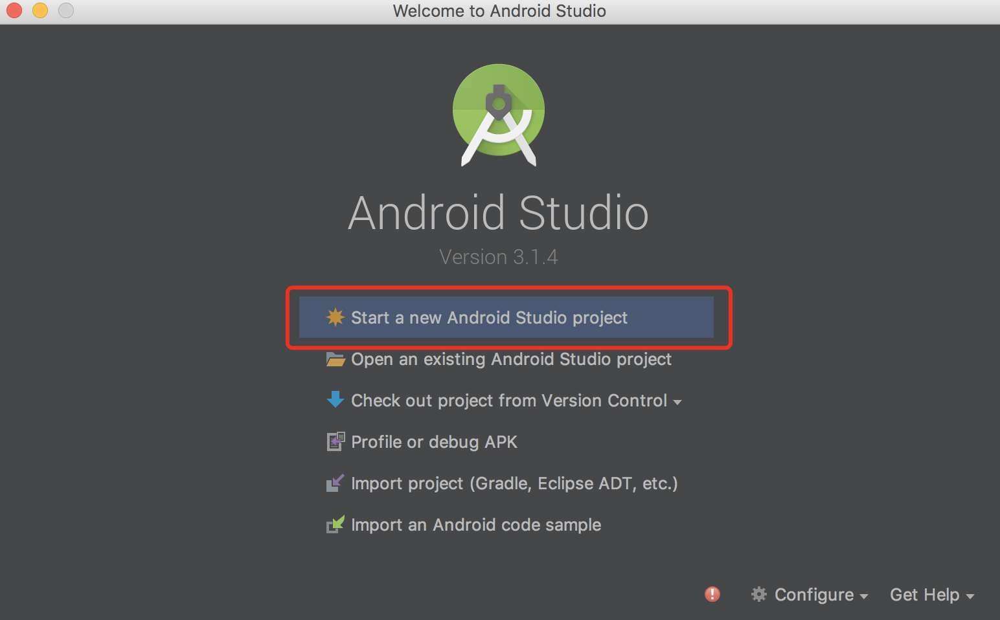
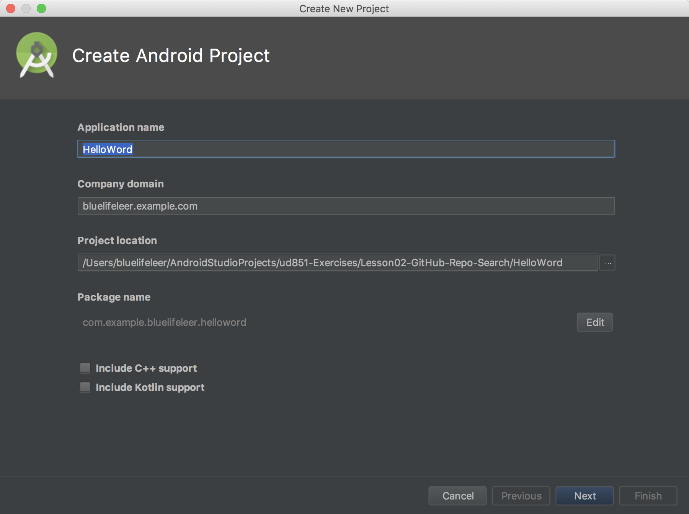
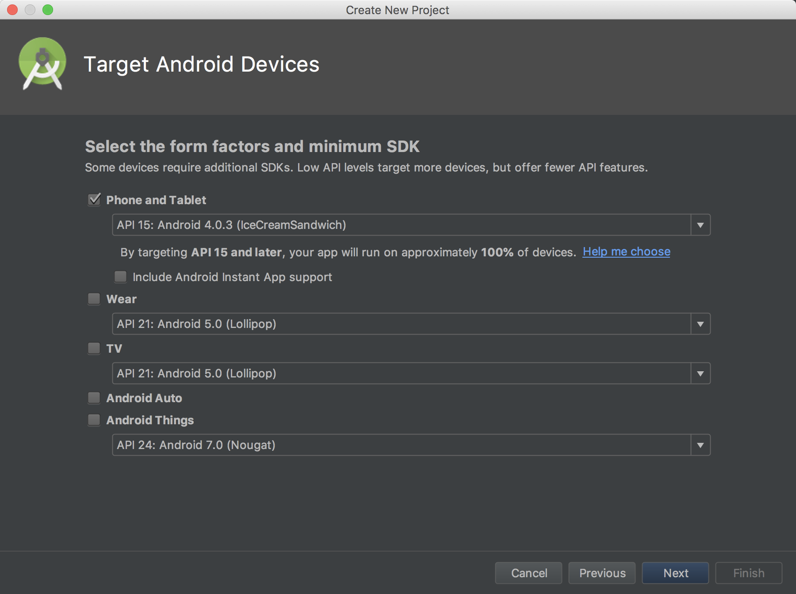
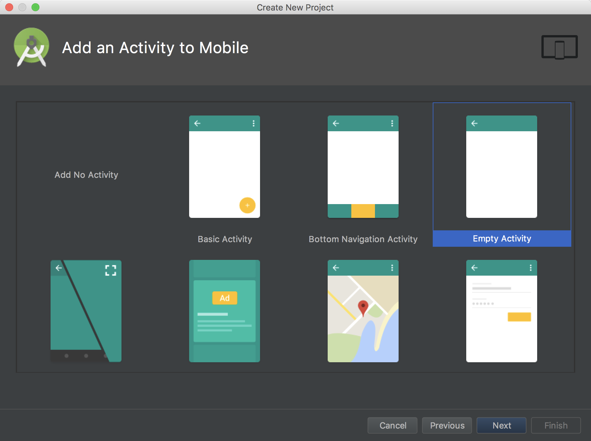
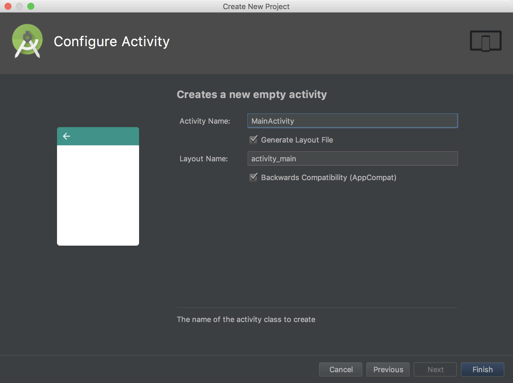
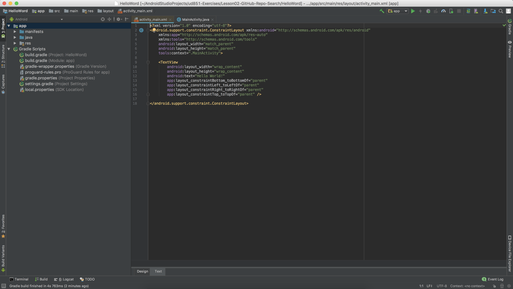

### android开发之Hello Word

> 学习任何一种技术helloWord上必须经历的步骤，本章节介绍如何创建第一个HelloWord应用。

### 第一步



> start a new android studio project

### 第二步



1:填写Application name为：HelloWord

2:填写Company domain为：

3:填写Project location：

4:点击next继续

###### 注：可以看到为保证打包编译后的每个应用都唯一，可双看到```Project name```自动将域名加应用名称进行了反写。

### 第三步



1：选择手机和平板
2：next继续
### 第四步



1：选择默认的空应用（empty activity）
2：next继续

### 第五步设置activity和硙文件的名称，选择默认



经过一段时间配置就打开了项目，然后可以进行功能开发代码编写。

### 打开项目



可以看到生成了activity.xml布局容器文件跟activity.java组件文件