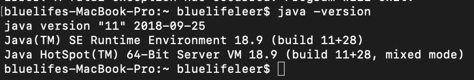
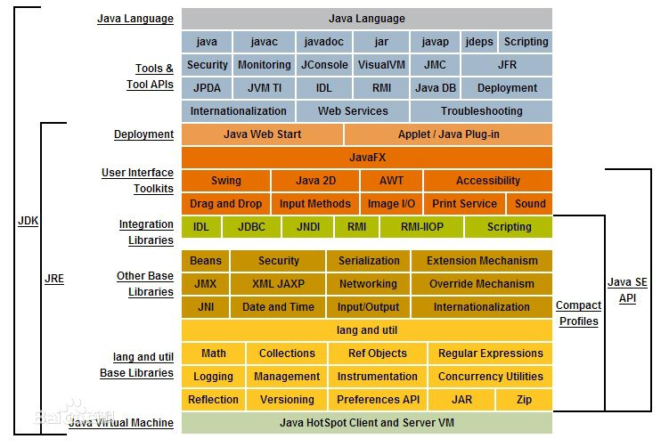

### 介绍

> Java是一门面向对象编程语言，不仅吸收了C++语言的各种优点，还摒弃了C++里难以理解的多继承、指针等概念，因此Java语言具有功能强大和简单易用两个特征。Java语言作为静态面向对象编程语言的代表，极好地实现了面向对象理论，允许程序员以优雅的思维方式进行复杂的编程 [1]  。
Java具有简单性、面向对象、分布式、健壮性、安全性、平台独立与可移植性、多线程、动态性等特点 [2]  。Java可以编写桌面应用程序、Web应用程序、分布式系统和嵌入式系统应用程序等[[来自百度]](https://baike.baidu.com/item/Java/85979?fr=aladdin 'https://baike.baidu.com/item/Java/85979?fr=aladdin')。

### 环境安装
* 1：下载开发环境JDK（Java Development Kit）。
* * [http://download.oracle.com/otn-pub/java/jdk/11.0.1+13/90cf5d8f270a4347a95050320eef3fb7/jdk-11.0.1_osx-x64_bin.dmg](http://download.oracle.com/otn-pub/java/jdk/11.0.1+13/90cf5d8f270a4347a95050320eef3fb7/jdk-11.0.1_osx-x64_bin.dmg 'http://download.oracle.com/otn-pub/java/jdk/11.0.1+13/90cf5d8f270a4347a95050320eef3fb7/jdk-11.0.1_osx-x64_bin.dmg')
* 2：配置环境变量。
* * 全局配置。
```
$ vim /etc/profile
export JAVA_HOME=/usr/local/jdk
export JAVA_BIN=$JAVA_HOME/bin
export JAVA_LIB=$JAVA_HOME/lib
export CLASSPATH=.:$JAVA_LIB/tools.jar:$JAVA_LIB/dt.jar
export PATH=$JAVA_BIN:$PATH 
```
* * 当前用户下配置。
```
$ cd ~
$ vim .bash_profile
export JAVA_HOME=/usr/local/jdk
export JAVA_BIN=$JAVA_HOME/bin
export JAVA_LIB=$JAVA_HOME/lib
export CLASSPATH=.:$JAVA_LIB/tools.jar:$JAVA_LIB/dt.jar
export PATH=$JAVA_BIN:$PATH 
```

* 3：使用环境变量生效
```
$ source ~/.bashrc 
```

* 4：检测是否安装成功。
```
$  java -version
```





### 第一个JAVA程序```Hello Word```

```
vim HelloWord.java

public class Test {
    public static void main(String[] args) {    
    System.out.println("Hello Java");
    }
}

javac HelloWord.java
java HelloWorld
```

[文档地址：https://docs.oracle.com/en/java/javase/11/](https://docs.oracle.com/en/java/javase/11/ 'https://docs.oracle.com/en/java/javase/11/').