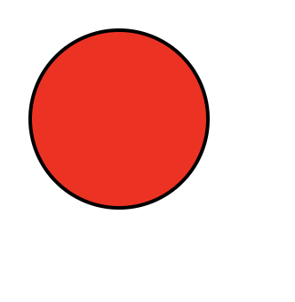

### 标签 ```<circle>```

* ```<circle></circle>```用来在svg画布上创建一个圆形区域

### 属性

* cx 用来指定圆的中心点横坐标
* cy 用来指定圆的中心点纵坐标
* r 用来指定圆的半径

### 样式

* fill  指定矩形填充颜色
* stroke 指定矩形边框颜色
* stroke-width 指定矩形边框宽度

### 实例

```
<?xml version="1.0" standalone="no"?>

<!DOCTYPE svg PUBLIC "-//W3C//DTD SVG 1.1//EN" 
"http://www.w3.org/Graphics/SVG/1.1/DTD/svg11.dtd">
<svg width="150" height="150" version="1.1"
xmlns="http://www.w3.org/2000/svg" xmlns:xlinks="http://www.w3.org/1999/xlink">
    <circle cx="70" cy="70" r="10" fill="#f00" stroke="#000" stroke-width="2"></circle>
</svg>
```

### 效果如图：
