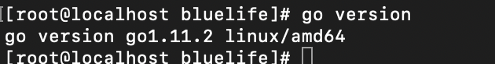

### Golang安装

#### 1：Golang下载

* wget [https://dl.google.com/go/go1.11.2.src.tar.gz](https://dl.google.com/go/go1.11.2.src.tar.gz 'https://dl.google.com/go/go1.11.2.src.tar.gz')

#### 2：Golang安装

* 解压```go1.11.2.src.tar.gz```

```
tar -zxvf go1.11.2.src.tar.gz
```

* 安装

```
cd go/src && ./all.bash
```

###### Golang高版本的安装需要go1.4版本来编译，所以在安装高版本的Golang时先安装Go1.4,将编译好的程序放在```/root/go1.4```目录下，此目录是安装高版本时依赖的go1.4的默认目录。

#### 3：Golang验证安装是否成功

```
cd ../bin
./go -V
```
