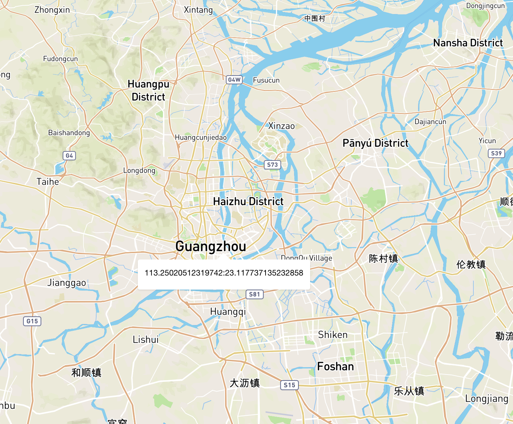

### Popup

#### 为地图添加一个一个弹出式组件。

### 语法

```
new Popup(options: Object?)
```

### 参数

* options(Object?)

|  名称  |  描述  |  参数  |
|----|----|----|
|  options.closeButtonboolean(default true)  |  是否显示关闭按纽，如果是true，则显示一个关闭按纽在弹出层右上角  |  Boolean  |
|  options.closeOnClickboolean(default true)  |  点击close按纽是否关闭弹出框，如果是true，则点击close按纽关闭弹出框  |  Boolean  |
|  options.anchorstring?  |  表示弹出窗口的一部分，该部分应该通过弹出窗口#setLngLat定位到最靠近坐标集的位置。选项有“中”、“上”、“下”、“左”、“右”、“上左”、“上右”、“下左”和“下右”。如果取消设置，则将动态设置锚，以确保弹出框位于map容器中，首选项为'bottom'。  |  String  |
|  options.offset(number,PointLike,Object)?  |  应用于弹出窗口的指定位置的像素偏移量:指定到弹出窗口位置的距离的单个数字  |  Number、PointLink、Object  |
|  options.classNamestring?  |  弹出框的类名  |  String  |

### 实例

```
var markerHeight = 50, markerRadius = 10, linearOffset = 25;
var popupOffsets = {
 'top': [0, 0],
 'top-left': [0,0],
 'top-right': [0,0],
 'bottom': [0, -markerHeight],
 'bottom-left': [linearOffset, (markerHeight - markerRadius + linearOffset) * -1],
 'bottom-right': [-linearOffset, (markerHeight - markerRadius + linearOffset) * -1],
 'left': [markerRadius, (markerHeight - markerRadius) * -1],
 'right': [-markerRadius, (markerHeight - markerRadius) * -1]
 };
var popup = new mapboxgl.Popup({offset: popupOffsets, className: 'my-class'})
  .setLngLat(e.lngLat)
  .setHTML("<h1>Hello World!</h1>")
  .addTo(map);
```

### 属性

|  名称  |  描述  |  参数  |
|----|----|----|
|  addTo(map)  |  将弹出框添加到地图上  |  map  |
|  isOpen()  |  弹出框是否打开  |  none  |
|  remove()  |  移除弹出框  |  none  |
|  getLngLat()  |  获取弹出框的中心点  |  none  |
|  setLngLat(lnglat)  |  设置弹出框的中心点  |  lnglat  |
|  setText(text)  |  设置弹出框的文本文字  |  Text  |
|  setHTML(html)  |  设置弹出框的HTML  |  Html  |
|  setDOMContent(htmlNode)  |  将弹出窗口的内容设置为作为DOM节点提供的元素。  |  DOM  |

### 事件

|  名称  |  描述  |  参数  |
|----|----|----|
|  open  |  监听弹出框打开  |    |
|  close  |  监听弹出框关闭  |    |

### 为地图添加一个弹出框并显示经纬度

```
map.on('load', function(){
	map.on('click', function(e){
		var Popup = new mapboxgl.Popup({
			closeButton:false,
			anchor:'top',
			className:'map-popup'
		}).setLngLat(e.lngLat).setText(e.lngLat.lng+':'+e.lngLat.lat).addTo(map);
			
	})
})
```

### 效果

