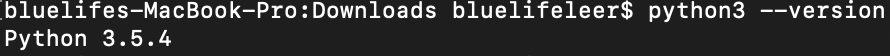
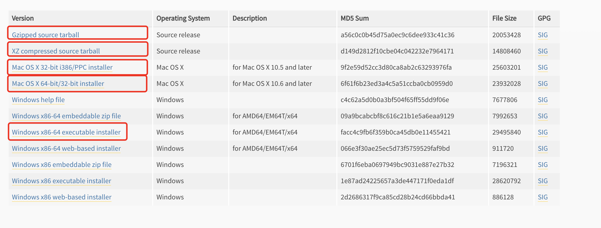

### Python安装

### window

* 在windows下安装比较简单，浏览器打开```https://www.python.org/downloads```进入页面根据自己需求选择对应的版本下载。然后一通```next```下去，直到完成。
* 在```doc```下输入```python -V```看到输出```python```版本信息表明安装成功，如果提示找不到程序或命令，需要将```python```添加到环境变量中，再执行。

### Linux

#### 如果是在```linux```下```Python```解析器已经存在了，可以直接使用，但是预装的```	python```版本是2.7的版本。
#### 如果要使用3.x以后的版本，则需要自己安装。
#### 对于```linux```系统下，```Python```网站提供源码安装包。如果你```linux```系统操作比较熟练可以使用源码安装包，这里使用```Python 3.5.0```的XZ压缩包,然后下载、解压后执行配置
编译、安装（一般自已安装的程序在```/usr/local/bin/python3.5```目录 下）即可，由于```/usr/local/bin```目录下的可执行文件也是系统可以直接读取到的，所以可以直接在命令终端输入```python3.5 --version```查看```python```版本，如果要替换已将存在的版本，将可执行文件建立软连接到```/usr/bin```目录下，提前要删除已经存在的软连接。

```
wget https://www.python.org/ftp/python/3.5.0/Python-3.5.0.tar.xz
tar -zxvf Python-3.5.0.tar.xz
./configure 
make
make install # 默认安装目录是/usr/local/bin/python3.5
ln -s /usr/local/bin/python3.5 /usr/bin/python3 # 由于系统中已经默认安装了python 2.7版本，为防止系统中有些软件使用python 2.7添加软连接后软件出问题，所以将新版本的python连接到python3。
```

#### 在```shell```终端下执行```python3 --version```。



### MAC OS

#### Mac下安装也比较简单，直接下载.dmg的包直接安装即可。

#### 在```Terminal```终端下执行```python --version```。


#### 网页下载标识



#### [下载页面连接：https://www.python.org/downloads/release/python-350/](https://www.python.org/downloads/release/python-350/ 'https://www.python.org/downloads/release/python-350/')