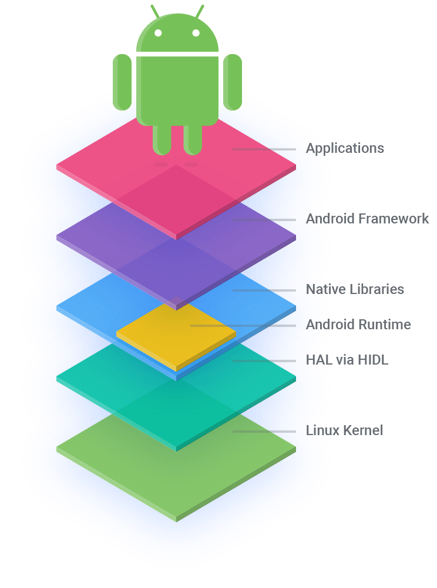

### Android开发学习

##### Android 应用采用 Java 编程语言编写。Android SDK 工具将您的代码 — 连同任何数据和资源文件 — 编译到一个 APK：Android 软件包，即带有 .apk 后缀的存档文件中。一个 APK 文件包含 Android 应用的所有内容，它是基于 Android 系统的设备用来安装应用的文件。

##### 安装到设备后，每个 Android 应用都运行在自己的安全沙箱内：
    * Android 操作系统是一种多用户 Linux 系统，其中的每个应用都是一个不同的用户；
    * 默认情况下，系统会为每个应用分配一个唯一的 Linux 用户 ID（该 ID 仅由系统使用，应用并不知晓）。系统为应用中的所有文件设置权限，使得只有分配给该应用的用户 ID 才能访问这些文件；
    * 每个进程都具有自己的虚拟机 (VM)，因此应用代码是在与其他应用隔离的环境中运行；
    * 默认情况下，每个应用都在其自己的 Linux 进程内运行。Android 会在需要执行任何应用组件时启动该进程，然后在不再需要该进程或系统必须为其他应用恢复内存时关闭该进程。

##### 使用工具Android Studio

##### 下载地址：['https://developer.android.com/studio/index'](https://developer.android.com/studio/index 'https://developer.android.com/studio/index')您可以自行前往下载及安装。

##### 本书为学习，不具权威性，如要看文档请稳步至['https://developer.android.com/guide/components/fundamentals'](https://developer.android.com/guide/components/fundamentals 'https://developer.android.com/guide/components/fundamentals')查看。

#### 安卓系统架构

### 学习就是一个大胆假设，小心求证的过程。