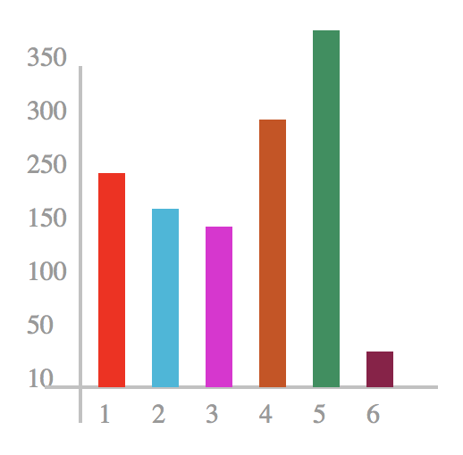

### ```<line>```标签

> ```<line></line>```标签用于在svg画布上绘制线条

### 属性

* x1 线条起始横坐标
* y1 线条起始纵坐标
* x2 线条结束横坐标
* y2 线条结束纵坐标
* stroke 线条颜色
* stroke-width 线条宽度
* fill 线条填充颜色

### 样式

* stroke 线条颜色
* stroke-width 线条宽度
* fill 线条填充颜色

### 实例

> 用矩形跟线条绘制的数据实图

```
<?xml version="1.0" standalone="no"?>

<!DOCTYPE svg PUBLIC "-//W3C//DTD SVG 1.1//EN" 
"http://www.w3.org/Graphics/SVG/1.1/DTD/svg11.dtd">

<svg width="300" height="280" version="1.1"
xmlns="http://www.w3.org/2000/svg" xmlns:xlinks="http://www.w3.org/1999/xlink">
    <g>
    	<line x1="50" y1="50" x2="50" y2="250" stroke="#c1c1c1" stroke-width="2"></line>
    	<text x="20" y="230" font-size="15" fill="#999">10</text>
    	<text x="20" y="200" font-size="15" fill="#999">50</text>
    	<text x="20" y="170" font-size="15" fill="#999">100</text>
    	<text x="20" y="140" font-size="15" fill="#999">150</text>
    	<text x="20" y="110" font-size="15" fill="#999">250</text>
    	<text x="20" y="80" font-size="15" fill="#999">300</text>
    	<text x="20" y="50" font-size="15" fill="#999">350</text>
    </g>
    <line x1="30" y1="230" x2="250" y2="230" stroke="#c1c1c1" stroke-width="2"></line>
    <g>
    	<rect x="60" y="110" width="15" height="120" fill="#F00"></rect>
    	<text x="60" y="250" font-size="15" fill="#999">1</text>
    </g>
    <g>
    	<rect x="90" y="130" width="15" height="100" fill="#07B8DB"></rect>
    	<text x="90" y="250" font-size="15" fill="#999">2</text>
    </g>
    <g>
    	<rect x="120" y="140" width="15" height="90" fill="#E809D5"></rect>
    	<text x="120" y="250" font-size="15" fill="#999">3</text>
    </g>
    <g>
    	<rect x="150" y="80" width="15" height="150" fill="#D14D0A"></rect>
    	<text x="150" y="250" font-size="15" fill="#999">4</text>
    </g>
    <g>
    	<rect x="180" y="30" width="15" height="200" fill="#13915C"></rect>
    	<text x="180" y="250" font-size="15" fill="#999">5</text>
    </g>
    <g>
    	<rect x="210" y="210" width="15" height="20" fill="#911348"></rect>
    	<text x="210" y="250" font-size="15" fill="#999">6</text>
    </g>
</svg>
```

### 效果如图：

