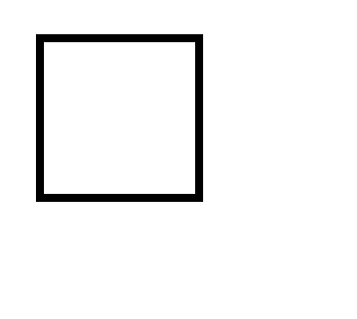

### 标签：```<rect>```
* ```<rect></rect>```用来在svg画布上创建一个矩形区域
### 属性：
* width 指定矩形的宽度
* height 指定矩形的高度
* x 指定矩形起始横坐标
* y 指定矩形起始纵坐标
### 样式：
* fill  指定矩形填充颜色
* stroke 指定矩形边框颜色
* stroke-width 指定矩形边框宽度

### 实例：

```
<?xml version="1.0" standalone="no"?>

<!DOCTYPE svg PUBLIC "-//W3C//DTD SVG 1.1//EN" 
"http://www.w3.org/Graphics/SVG/1.1/DTD/svg11.dtd">
<svg width="150" height="150" version="1.1"
xmlns="http://www.w3.org/2000/svg" xmlns:xlinks="http://www.w3.org/1999/xlink">
    <rect width="100" height="100" x="25" y="25" fill="#FFF" stroke="#000" stroke-width="5"></rect>
</svg>
```

### 效果如图：
