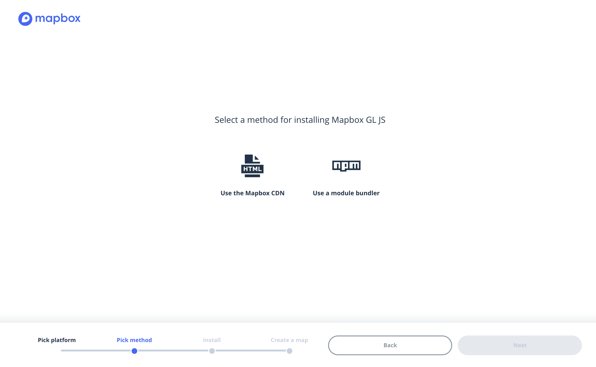

### MapBox安装

#### 注册帐号登录

##### 打开[https://www.mapbox.com/](https://www.mapbox.com/ 'https://www.mapbox.com/')注册一个帐号并登录


#### 创建```acceaa_token```

##### 登录成功进入帐号中心创建一个```acceaa_token```，在登录成功后会自动生成一个```MapBox```默认的```access_token```，在些可以使用默认的也可以选择创建一个新的来替换默认的。


#### 配置环境

##### 在控制中心显示了安装SDK的方式，有```web JS```，```android SDK```，```ios SDK```，在此选择```web JS```安装。



web js安装可以使用CDN的方式也可以使用npm module builder的方式，视自己项目需要选择。然后按照页面索引一步步NEXT来操作。

#### 检测浏览器是否支持Mapbox GL JS

##### mapboxgl.supported()会返回一个Boolen值true/false，来标识浏览器是否支持Mapbox GL JS

```
if(!mapboxgl.supported()){
    // your handle code
}
```

##### 完整代码

```
<!DOCTYPE html>
<html>
<head>
	<meta http-equiv="Content-Type" content="text/html;charset=utf-8" />
	<title>MapBox</title>
	<link href='https://api.mapbox.com/mapbox-gl-js/v0.51.0/mapbox-gl.css' rel='stylesheet' />
	<script src='https://api.mapbox.com/mapbox-gl-js/v0.51.0/mapbox-gl.js'></script>
	<style type="text/css">
		body,html,div{
			padding:0;
			margin:0;
		}
	</style>
</head>
<body>
<div id='map' style='width: 100%; height: 780px;'></div>
</body>
<script type="text/javascript">
    // 检测浏览器是否支持Mapbox GL JS
    if(!mapboxgl.supported()){
		alert('您的浏览器不支持 Mapbox GL JS.')
	}

	mapboxgl.accessToken = 'pk.eyJ1IjoiYmx1ZWxpZmUiLCJhIjoiY2puenNlMmg0MHB2OTNwcW91ejIxbzUxayJ9.rNj758FD0Gx23JuWS1wLDw';	// 配置的accessToken
	var map = new mapboxgl.Map({
		container: 'map',
		style: 'mapbox://styles/mapbox/streets-v10',
		center:[120.207821,30.245352],	// 指定地图中心坐标
		zoom:9	// 指定地图缩放级别
	});
</script>
</html>
```

安装完成预览效果：


###### 至此安装完成，可以看到实例化一个地图资源指向```map```，以后所有的地呼操作都在这个```map```下操作。如：
* map.setCenter()   // 设置地图中心
* map.setZoom()     // 设置地图缩放级别
* map.getCenter()   // 获取地图中心
* map.getZoom()     // 获取地图缩放级别
* map.addControl()  // 添加控件
* map.addLayer()    // 添加地图层
* map.on()          // 地图添加事件，会在地图事件中详细介绍

#### 可以看出在初始化时指定必要的参数```container```，```style```，```center```，```zoom```就可以很方便的创建一个MapBox的地图出来，当然参数也不止这几个，关于new mapboxgl.Map初始化参数会在后面做详细讲解。