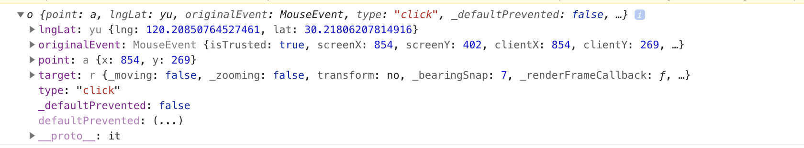

### map对象介绍

##### map对象是MapBox地图的主体承载着地图的所有操作。下面将详细介绍map对象下的各种方法及属性，如设置地图中心、设置地图缩放级别，添加控件添加图层、添加事件等。

#### map对象方法

|  方法名  |  描述  |  参数  |  备注  |
|----|----|----|----|
|  getCenter()  |  获取地图中心点  |    |    |
|  setCenter(center, eventData)  |  设置地图中心点  |    |    |
|  addControl(control, position?)  |  添加控件  |    |    |
|  removeControl(control)  |  删除缺件  |    |    |
|  resize(eventData)  |  重置地图  |    |    |
|  zoomTo(zoom, options, eventData)  |  地图缩放到指定级别  |    |    |
|  zoomIn(options, eventData)  |  将地图放大一级  |    |    |
|  zoomOut(options, eventData)  |  将地图缩小一级  |    |    |
|  getBearing()  |    |    |    |
|  setBearing(bearing, eventData)  |    |    |    |
|  rotateTo(bearing, options, eventData)  |  将地图旋转到指定角度  |    |    |
|  panTo(lnglat, options, eventData)  |  将地图移动地指定位置  |    |    |
|  listImages()  |    |    |    |
|  loadImage(url, callback)  |    |    |    |
|  removeImage(id)  |    |    |    |
|  hasImage(id)  |    |    |    |
|  addImage(id, image, options)  |    |    |    |
|  setStyle(style, options?)  |    |    |    |
|  getStyle()  |    |    |    |
|  isStyleLoaded()  |    |    |    |
|  setZoom(zoom, eventData)  |  设置地图缩放等级  |    |    |
|  getZoom()  |  获取地图缩放等级  |    |    |
|  on(type, listener)  |  为地图添加事件  |    |    |
|  on(type, layer, listener)  |  为地图图层添加事件  |    |    |
|  loaded()  |  地图加载完成  |    |    |
|  load()  |    |    |    |
|  remove()  |    |    |    |
|  jumpTo(options, eventData)  |  地图跳到指定位置  |    |    |
|  stop()  |  停止地图加载  |    |    |
|  addLayer(layer, before?)  |  添加一个图层  |    |    |
|  moveLayer(id, beforeId?)  |  移除一个图层  |    |    |
|  addSource(id, source)  |  添加一个资源  |    |    |
|  isSourceLoaded(id)  |  资源是否加载完成  |    |    |
|  removeSource(id)  |  移除指定资源  |    |    |
|  getSource(id)  |  获取指定的资源  |    |    |

#### map对象事件

|  方法名  |  描述  |  参数  |  备注  |
|----|----|----|----|
|  resize  |  地图重置  |    |    |
|  remove  |  移除地图  |    |    |
|  mousedown  |    |    |    |
|  mouseup  |    |    |    |
|  mouseover  |    |    |    |
|  mousemove  |    |    |    |
|  click  |  在地图点击事件  |    |    |
|  dblclick  |  在地图上双击  |    |    |
|  mouseenter  |    |    |    |
|  mouseout  |    |    |    |
|  mouseleave  |    |    |    |
|  contextmenu  |  在地图上右键点击  |    |    |
|  wheel  |    |    |    |
|  touchstart  |  在地图触摸开始  |    |    |
|  touchend  |  在地图触摸结束  |    |    |
|  touchmove  |  手指移动地图  |    |    |
|  touchcancel  |  在地图上长按取消  |    |    |
|  movestart  |  移动地图开始  |    |    |
|  move  |    |  移动地图过程进行时  |    |
|  moveend  |  移动地图结束  |    |    |
|  dragstart  |    |    |    |
|  drag  |    |    |    |
|  dragend  |    |    |    |
|  zoomstart  |  地图缩放开始  |    |    |
|  zoom  |  地图缩放过程中  |    |    |
|  zoomend  |  地图缩放结束  |    |    |
|  rotatestart  |  地图旋转开始  |    |    |
|  rotate  |    |  地图旋转过程中  |    |
|  rotateend  |  地图旋转结束  |    |    |
|  pitchstart  |    |    |    |
|  pitch  |    |    |    |
|  pitchend  |    |    |    |
|  boxzoomstart  |    |    |    |
|  boxzoomend  |    |    |    |
|  boxzoomcancel  |    |    |    |
|  load  |  地图加载  |    |    |
|  render  |  地图渲染  |    |    |
|  error  |  地图发生错误  |    |    |
|  data  |    |    |    |
|  styledata  |    |    |    |
|  sourcedata  |    |    |    |
|  dataloading  |    |    |    |
|  styledataloading  |    |    |    |
|  sourcedataloading  |    |    |    |


##### map对象通过```on```方法为地图添加事件

##### 添加事件实例

```
// 为地图添加点击事件
map.on('click', function(data){
    console.log(data)
})
// 添加错误事件
map.on('error', function(err){
		console.log(err)
	})
```

