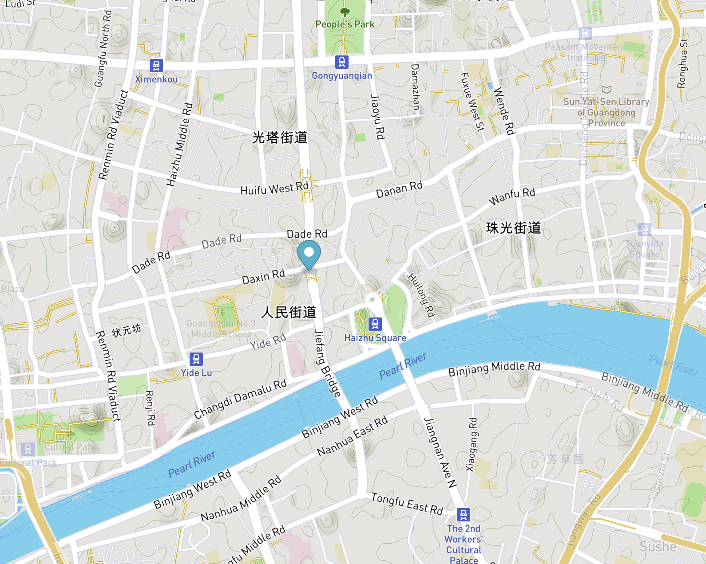

### Marker用户为地图添加标记

```
new Marker(options: Object?)
```

#### options参数

|  名称  |  描述  |  值类型  |
|----|----|----|
|  options.elementHTMLElement  |  要用作标记的DOM元素。默认值是淡蓝色的、下垂的SVG标记。  |  DOCUMENT  |
|  options.anchorstring(default 'center')  |  表示应该通过标记#setLngLat定位到最接近坐标集的标记部分。选项有“中”、“上”、“下”、“左”、“右”、“上左”、“上右”、“下左”和“下右”。  |  string  |
|  options.offsetPointLike  |  以像素为单位的偏移量作为一个类点对象，相对于元素的中心应用。负数表示向左或向上。  |  PointLike  |
|  options.colorstring(default '#3FB1CE')  |  用于默认标记选项的颜色。元素没有提供。默认为淡蓝色。  |  string  |
|  options.draggableboolean(default false)  |  指示标记是否能够被拖动到地图上的新位置 。  |  Boolen  |

### 实例

```
var marker = new mapboxgl.Marker()
  .setLngLat([30.5, 50.5])
  .addTo(map);
```

### 实例方法

|  名称  |  描述  |    |
|----|----|----|
|  addTo(map)  |  将标记添加到地图  |    |
|  remove()  |  移除标记  |    |
|  getLngLat()  |  获取中心点  |    |
|  setLngLat(lnglat)  |  设置中心点  |    |
|  getElement()  |  获取元素  |    |
|  setPopup(popup)  |  绑定一个弹出框到标记  |    |
|  getPopup()  |  返回绑定到标记的弹出窗口实例  |    |
|  togglePopup()  |  根据当前状态，打开或关闭绑定弹出窗口  |    |
|  getOffset()  |    |  获取标记的偏移量。  |
|  setOffset(offset)  |  设置标记的偏移量，偏移量(类点)以像素为单位的偏移量，作为相对于元素的中心应用的类点对象。负数表示向左或向上。  |  PointLike  |
|  setDraggable(shouldBeDraggable)  |  设置标记的可拖动属性和功能  |    |
|  isDraggable()  |  返回标记是否可以被拖动，是则返回true  |    |

### 事件

|  名称  |  描述  |    |
|----|----|----|
|  dragstart  |  启动拖动时被触发  |    |
|  drag  |  标记拖动过程中触发  |    |
|  dragend  |  当标记被拖动完成时，就会被触发  |    |


### Marker 为地图添加标记

```
var marker = new mapboxgl.Marker({
                draggable: true
            })
            .setLngLat(LonLat)
            .addTo(map);
```


### 使用标记为地图添加自定义图标

```
var geojson = {
    "type": "FeatureCollection",
    "features": [
        {
            "type": "Feature",
            "properties": {
                "message": "Foo",
                "iconSize": [60, 60]
            },
            "geometry": {
                "type": "Point",
                "coordinates": [
                    -66.324462890625,
                    -16.024695711685304
                ]
            }
        },
        {
            "type": "Feature",
            "properties": {
                "message": "Bar",
                "iconSize": [50, 50]
            },
            "geometry": {
                "type": "Point",
                "coordinates": [
                    -61.2158203125,
                    -15.97189158092897
                ]
            }
        },
        {
            "type": "Feature",
            "properties": {
                "message": "Baz",
                "iconSize": [40, 40]
            },
            "geometry": {
                "type": "Point",
                "coordinates": [
                    -63.29223632812499,
                    -18.28151823530889
                ]
            }
        }
    ]
};

var map = new mapboxgl.Map({
    container: 'map',
    style: 'mapbox://styles/mapbox/streets-v9',
    center: [-65.017, -16.457],
    zoom: 5
});

// add markers to map
geojson.features.forEach(function(marker) {
    // create a DOM element for the marker
    var el = document.createElement('div');
    el.className = 'marker';
    el.style.backgroundImage = 'url(https://placekitten.com/g/' + marker.properties.iconSize.join('/') + '/)';
    el.style.width = marker.properties.iconSize[0] + 'px';
    el.style.height = marker.properties.iconSize[1] + 'px';

    el.addEventListener('click', function() {
        window.alert(marker.properties.message);
    });

    // add marker to map
    new mapboxgl.Marker(el)
        .setLngLat(marker.geometry.coordinates)
        .addTo(map);
});
```


### 点击地图时添加一个锚点

```
map.on('load', function(){
    map.on('click', function(e){
        var marker = new mapboxgl.Marker()
        .setLngLat(e.lngLat)
        .addTo(map);
    })
})
```

### 效果


