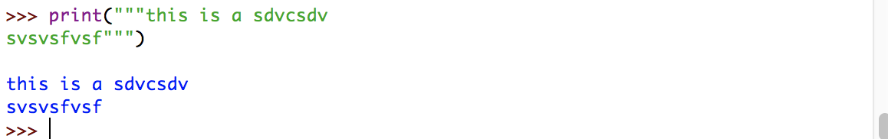

### Python内置函数

> Python解释器中内置了许多函数和类型，这些函数和类型总是可用的。

#### print函数

> print是Python中一个内置函数，用于在控制台输出特定的信息。

#### 语法：

```
print(argument)
```

##### argument 要输出的信息

#### 实例

* 输出信息
```
print('Hello Word')
```

###### 提示：在Python2中print是一个表达式，在Python3中print是一个内置函数。

#### 在Python中输出多行文本

> 在Python中输出多行文本使用三个英文双引号“"""”。

##### 实例：

```
print("""this is a sdvcsdv
svsvsfvsf""")
```

##### 效果如图：



#### 在Python中使用转义字符

> 转义字符是一系例特殊字符，它允许一条python语句”偏离“正常的行为，通常用于输出格式化或保护字符，转义字符全部以反斜杠（\）开头。

#### Python中的常用转义符：

|  转义符  |  描述  |
|----|---|
|  \'  |  输出一个单引号  |
|  \"  |  输出一个双引号  |
|  \\  |  输出一个反斜杠  |
|  \a  |  在输出中制造一个钟声  |
|  \f  |  在输出中插入一个分页  |
|  \n  |  在输出中插入一个换行  |
|  \t  |  在输出中插入一个水平制表符  |
|  \u####  |  显示以四个十六进制数字（####）所表示的Unicode字符  |

##### 圆周率的Unicode十六进制符号为03c0,在print函数中输出：```print('\u03c0')```。

### 更多内置函数

|  函数名  |  参数  |  描述  |  返回值  |
|----|----|-----|----|
|  abs()  |    |  返回一个数字的绝对值。参数可以是整数或浮点数。如果参数是复数，则返回其大小。  |    |
|  all()  |    |  在一个迭代中如果所有元素（或者迭代为空时）都为True，则返回True。  |    |
|  any()  |    |  在一个迭代中如果所有元素都为True，则返回True。如果迭代为空则返回Flase。  |    |
|  ascii()  |    |    |    |
|  bin()  |    |    |    |
|  bool()  |    |    |    |
|  breakpoint()  |    |    |    |
|  bytearray()  |    |    |    |
|  bytes()  |    |    |    |
|  callable()  |    |    |    |
|  chr()  |    |    |    |
|  classmethod()  |    |    |    |
|  compile()  |    |    |    |
|  complex()  |    |    |    |
|  delattr()  |    |    |    |
|  dict()  |    |    |    |
|  dir()  |    |    |    |
|  divmod()  |    |    |    |
|  enumerate()  |    |    |    |
|  eval()  |    |  参数是字符串，可选的全局变量和局部变量。如果提供的话，globals必须是一个字典。如果提供的话，局部变量可以是任何映射对象。  |    |
|  exec()  |    |  这个函数支持Python代码的动态执行。对象必须是字符串或代码对象。如果是字符串，则将字符串解析为一组Python语句，然后执行这些语句(除非出现语法错误)。如果它是一个代码对象，就简单地执行它。在所有情况下，执行的代码都应该作为文件输入有效(请参阅参考手册中的“文件输入”一节)。请注意，return和yield语句不能在函数定义之外使用，即使是在传递给exec()函数的代码上下文中。返回值为None。  |    |
|  filter()  |    |    |    |
|  float()  |    |    |    |
|  format()  |    |    |    |
|  frozenset()  |    |    |    |
|  getattr()  |    |    |    |
|  globals()  |    |    |    |
|  hasattr()  |    |  参数是对象和字符串。如果字符串是对象属性之一的名称，则结果为True，如果不是，则为False。(这是通过调用getattr(对象、名称)和查看它是否引发AttributeError来实现的。)  |    |
|  hash()  |    |  返回对象的散列值(如果有的话)。哈希值是整数。它们用于在字典查找期间快速比较字典键。比较相等的数值具有相同的散列值(即使它们是不同的类型，如1和1.0)。  |    |
|  help()  |    |    |    |
|  hex()  |    |  将整数转换为以“0x”为前缀的小写十六进制字符串。如果x不是Python int对象，它必须定义一个返回整数的__index__()方法。一些例子:  |    |
|  id()  |    |  返回对象的“标识”。这个整数保证在这个对象的生命周期内是唯一的和常量。具有不重叠生存期的两个对象可能具有相同的id()值。  |    |
|  input()  |    |  如果存在提示参数，则将其写入标准输出，而不使用尾随换行符。然后，函数从输入中读取一行，将其转换为字符串(去掉尾随的换行符)，并返回该字符串。当读取EOF时，会引发EOFError。  |    |
|  int()  |    |    |    |
|  isinstance()  |    |  如果对象参数是classinfo参数的实例，或其(直接、间接或虚拟)子类的实例，则返回true。如果对象不是给定类型的对象，函数总是返回false。如果classinfo是类型对象的元组(或者递归地，其他的元组)，如果object是任何类型的实例，返回true。如果classinfo不是类型或类型的元组，那么就会引发类型错误异常。  |    |
|  issubclass()  |    |  如果类是classinfo的子类(直接、间接或虚拟)，则返回true。一个类被认为是它自己的子类。classinfo可能是类对象的一个元组，在这种情况下，classinfo中的每个条目都会被检查。在任何其他情况下，都会引发类型错误异常。  |    |
|  iter()  |    |  返回迭代器对象。根据第二个论证的存在，第一个论证的解释非常不同。如果没有第二个参数，对象必须是一个集合对象，它支持迭代协议(__iter__()方法)，或者它必须支持序列协议(__getitem__()方法，整数参数从0开始)。如果第二个参数sentinel是给定的，那么对象必须是可调用的对象。在本例中创建的迭代器将调用对象，每个对其__next__()方法的调用都没有参数;如果返回的值等于sentinel，那么StopIteration就会上升，否则返回值。  |    |
|  len()  |    |  返回对象的长度(项的数量)。参数可以是序列(例如字符串、字节、元组、列表或范围)或集合(例如字典、集合或冻结集合)。  |    |
|  list()  |    |  list不是一个函数，而是一个可变序列类型，如列表和序列类型(列表、元组、范围)中所示。  |    |
|  locals()  |    |  更新并返回表示当前本地符号表的字典。当在函数块中调用自由变量时，局部变量返回，但在类块中不返回。  |    |
|  map()  |    |  返回一个迭代器，该迭代器将函数应用于iterable的每一项，生成结果。如果传递了其他的可迭代参数，那么函数必须接受这些参数，并并行地应用于所有迭代项。对于多个迭代器，当最短的迭代器耗尽时，迭代器停止。对于已经将函数输入安排到参数元组中的情况，请参阅itertools.starmap()。  |    |
|  max()  |    |  返回可迭代或两个或多个参数中最大的项。  |    |
|  memoryview()  |    |    |    |
|  min()  |    |  返回迭代中最小的项或两个或多个参数中的最小项。  |    |
|  next()  |    |  通过调用迭代器的__next__()方法从迭代器中检索下一个项目。如果给定了默认值，如果迭代器耗尽，则返回该值，否则将引发StopIteration。  |    |
|  object()  |    |  返回一个新的无特征对象。对象是所有类的基。它具有Python类的所有实例都通用的方法。这个函数不接受任何参数。  |    |
|  oct()  |    |    |    |
|  open()  |    |  打开文件并返回相应的文件对象。如果文件无法打开，将引发一个OSError。  |    |
|  ord()  |    |    |    |
|  pow()  |    |  返回x的y次方;如果存在z，则返回x到幂y，模z(比pow(x, y) % z计算效率更高)。  |    |
|  print()  |    |    |    |
|  property()  |    |    |    |
|  range()  |  start,stop  |  生成一个指定开始、结束的序列。  |    |
|  repr()  |    |    |    |
|  reversed()  |    |    |    |
|  round()  |    |  返回小数点后的四舍五入数字精度。如果省略或没有nnumbers，则返回其输入的最近整数。  |    |
|  set()  |    |  返回一个新的set对象，可选地使用iterable中的元素。set是一个内置类。有关这个类的文档，请参阅set和set type - set, frozenset。  |    |
|  setattr()  |    |  这是getattr()的对等物。参数是对象、字符串和任意值。字符串可以命名现有属性或新属性。如果对象允许，函数将值分配给属性。例如，setattr(x， 'foobar'， 123)等于x。foobar = 123。  |    |
|  slice()  |    |  返回一个slice对象，表示由range(start, stop, step)指定的一组索引。start和step参数默认为None。Slice对象具有只读数据属性start、stop和step，它们只返回参数值(或它们的默认值)。它们没有其他显式功能;但是，它们被Numerical Python和其他第三方扩展使用。在使用扩展索引语法时还会生成片对象。例如:a[start:stop:step]或a[start:stop, i]。有关返回迭代器的替代版本，请参阅itertools.islice()。  |    |
|  sorted()  |    |  从iterable中的项目返回一个新的排序列表。  |    |
|  staticmethod()  |    |    |    |
|  str()  |    |  返回对象的str版本  |    |
|  sum()  |    |  返回一个迭代从左到右所有项的决和，开始默认为0。迭代项通常是数字，起始值不允许是字符串。  |    |
|  super()  |    |  返回一个代理对象，该代理对象将方法调用委托给类型的父类或兄弟类。这对于访问在类中被重写的继承方法非常有用。搜索顺序与getattr()使用的顺序相同，只是跳过了类型本身。  |    |
|  tuple()  |    |    |    |
|  type()  |    |  对于一个参数，返回对象的类型。返回值是一个类型对象，通常与object.__class__返回的对象相同。  |    |
|  vars()  |    |  返回带有__dict__属性的模块、类、实例或任何其他对象的__dict__属性。  |    |
|  zip()  |    |  创建一个聚合每个迭代元素的迭代器。返回元组的迭代器，其中第i个元组包含每个参数序列或迭代的第i个元素。当最短的可迭代输入耗尽时，迭代器停止。通过一个可迭代的参数，它返回一个1元组的迭代器。没有参数，它返回一个空迭代器。  |    |
|  __impoer__  |    |    |    |

#### 官方文档：[https://docs.python.org/3/library/functions.html](https://docs.python.org/3/library/functions.html 'https://docs.python.org/3/library/functions.html')