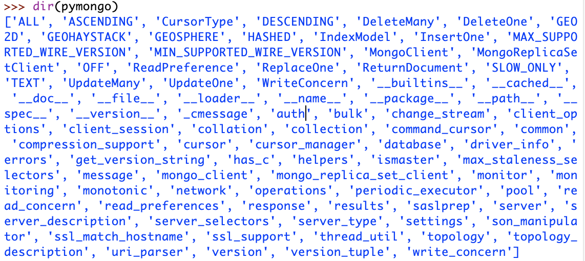

### pymongo

> pymongo是一个python操作mongoDB的库，使用pymongo可以很方便的操作mongodb数据库。

### 安装

```
pip install pymongo
```

### 导入模块

```
import pymongo
# 导入MongoClient客户端口
from pymongo import MongoClient

```

### 查询模块中的方法

```
dir(pymongo)
```
#### 显示如下：



### 使用

```
import pymongo
from pymongo import MongoClient


# 使用MongoClient
client = MongoClient("localhost", 27017)
# client = MongoClient("mongodb://localhost:27017/")

db = client.test
# db = client['test']

collections = db.collection
# collections = db['collection']

collections.find_one()

```

### collection.insert_one()

> 插入一条数据

### collection.insert_many([])

> 一次性插入多条数据

### collection.find_one()

> 查询一条数据

### collection.find()

> 查询多条数据

### collection.count_documents()

> 获取文档数量

### collection.insert_one().inserted_id

> 返回通过```insert_one```插入文档的id

### collection.insert_many().inserted_ids

> 返回通过```insert_many()```插入的所有文档id

### db.profiles.create_index([],unique=True)

> 给文档添加一个索引，unique=True是否唯一。

### 参考连接：

[https://pypi.org/project/pymongo/](https://pypi.org/project/pymongo/ 'https://pypi.org/project/pymongo/')

[https://docs.mongodb.com/ecosystem/drivers/python/](https://docs.mongodb.com/ecosystem/drivers/python/ 'https://docs.mongodb.com/ecosystem/drivers/python/')

[https://pymodm.readthedocs.io/en/latest/getting-started.html](https://pymodm.readthedocs.io/en/latest/getting-started.html 'https://pymodm.readthedocs.io/en/latest/getting-started.html')

[https://docs.mongodb.com/manual/tutorial/getting-started/](https://docs.mongodb.com/manual/tutorial/getting-started/ 'https://docs.mongodb.com/manual/tutorial/getting-started/')

[http://api.mongodb.com/python/current/tutorial.html](http://api.mongodb.com/python/current/tutorial.html 'http://api.mongodb.com/python/current/tutorial.html')