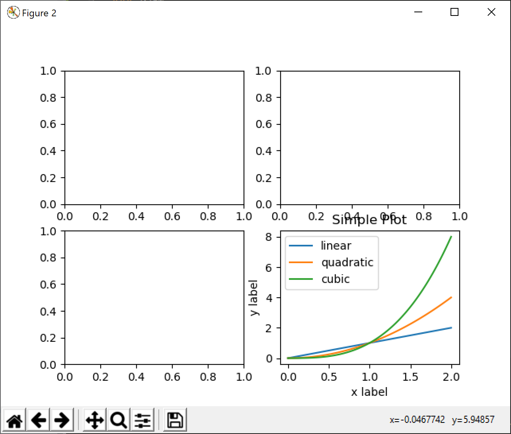
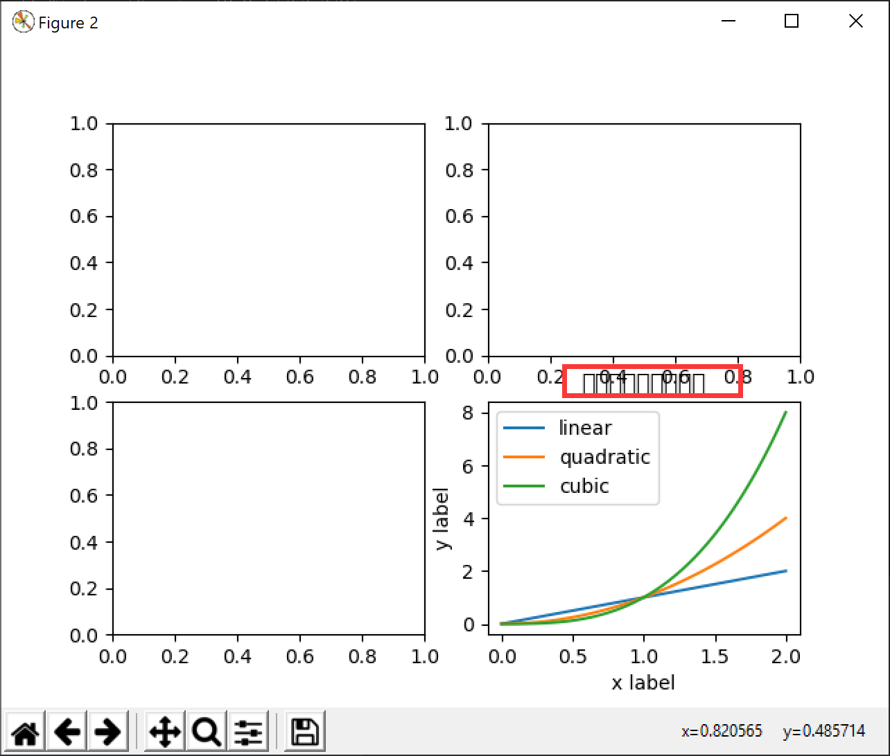
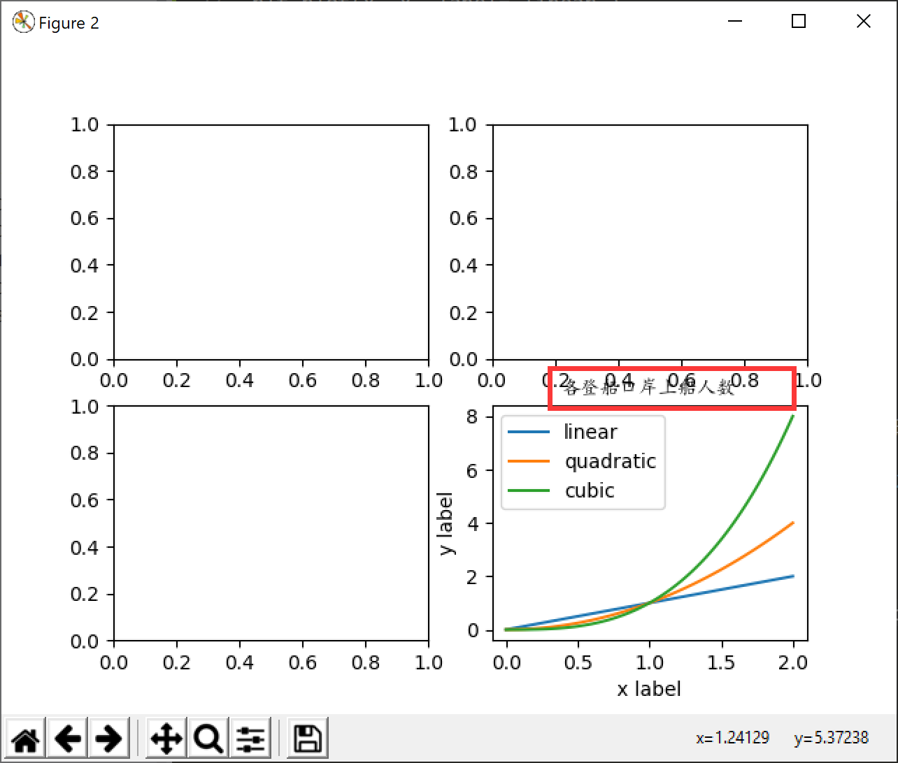

# python可视化matplotlib

### 简介

Matplotlib是一个Python 2D绘图库，它以各种硬拷贝格式和跨平台的交互环境生成出版物质量数据。Matplotlib可以用于Python脚本、Python和IPython shell、Jupyter笔记本、web应用服务器和四个图形用户界面工具包。

### 安装

```
python -m pip install -U pip
python -m pip install -U matplotlib
```

### 实例：

```
#encoding=utf-8
import matplotlib.pyplot as plt
import numpy as np
fig = plt.figure()
fig.suptitle('No axes on this figure')
fig, ax_lst = plt.subplots(2, 2)
x = np.linspace(0, 2, 100)
plt.plot(x, x, label='linear')
plt.plot(x, x**2, label='quadratic')
plt.plot(x, x**3, label='cubic')
plt.xlabel('x label')
plt.ylabel('y label')
plt.title("Simple Plot")
plt.legend()
plt.show()
```

#### 效果图：



##### 提示：

> 显示中文的问题,在图表中如果有中文字符，显示时会出现乱码的问题（中文显示的是一个个小方块）。如下：



> 解决方法就是在使用中文时指定中文显示的字体

```
matplotlib.font_manager.FontProperties(fname='C:\Windows\Fonts\simkai.ttf')
```

* 代码如下：

```
#encoding=utf-8

import matplotlib
import matplotlib.pyplot as plt
import numpy as np
import pandas

myfont = matplotlib.font_manager.FontProperties(fname='C:\Windows\Fonts\simkai.ttf')

fig = plt.figure()  # an empty figure with no axes
fig.suptitle('中文测试', fontproperties=myfont)  # Add a title so we know which it is

fig, ax_lst = plt.subplots(2, 2)  # a figure with a 2x2 grid of Axes
a = pandas.DataFrame(np.random.rand(4,5), columns = list('abcde'))
a_asndarray = a.values

b = np.matrix([[1,2],[3,4]])
b_asarray = np.asarray(b)

x = np.linspace(0, 2, 100)

plt.plot(x, x, label='linear')
plt.plot(x, x**2, label='quadratic')
plt.plot(x, x**3, label='cubic')

plt.xlabel('x label')
plt.ylabel('y label')

plt.title(u"各登船口岸上船人数", fontproperties=myfont)

plt.legend()

plt.show()
```



文档：[https://matplotlib.org/](https://matplotlib.org/ 'https://matplotlib.org/')
