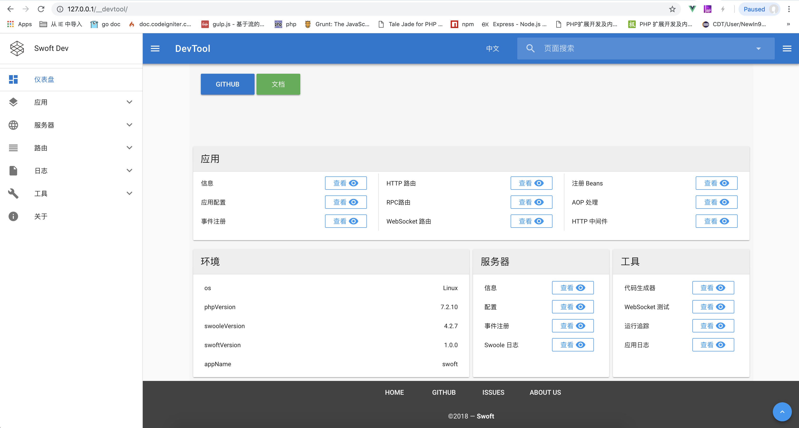

# Swoft开发工具

### DevTool 配置

> 要完整的启用 DevTool, 需要添加一些配置和进行一点操作。

* 1：在 ```config/beans/base.php``` 添加 HTTP 中间件让 DevTool 介入请求声明周期。


```
'serverDispatcher' => [
      'middlewares' => [
          // ...
          \Swoft\Devtool\Middleware\DevToolMiddleware::class,
      ]
 ],
 ```

* 2：DevTool 配置，用于标识是否启用某些功能(config/properties/app.php)，如不存在可自行添加配置。

```
'devtool' => [
    // 是否开启 DevTool，默认值为 false
    'enable' => true,
    // (可选)前台运行服务器时，是否打印事件调用到 Console
    'logEventToConsole' => true,
    // (可选)前台运行服务器时，是否打印 HTTP 请求到 Console
    'logHttpRequestToConsole' => true,
],
```

* 3：发布 DevTool 的静态资源到项目的 public 目录。

> 在项目目录下执行：

```
php bin/swoft dev:publish swoft/devtool
// -f 将会删除旧的资源，每次devtool更新后请都带上这个选项重新执行一次命令
php bin/swoft dev:publish swoft/devtool -f
```

* 配置完成生重启服务器，可以通过浏览器访问 ```SCHEME://HOST:PORT/__devtool（e.g. [http://127.0.0.1:80/__devtool](http://127.0.0.1:80/__devtool 'http://127.0.0.1:80/__devtool')）```。

```
php bin/swoft start
```

* 如果你能看到下面的截图，说明已经成功安装并启用



### 开发工具控制器文件

```
./vendor/swoft/devtool/src/WebSocket/DevToolController.php
```


[文档连接：https://doc.swoft.org/master/zh-CN/devtool/config.html](https://doc.swoft.org/master/zh-CN/devtool/config.html 'https://doc.swoft.org/master/zh-CN/devtool/config.html')